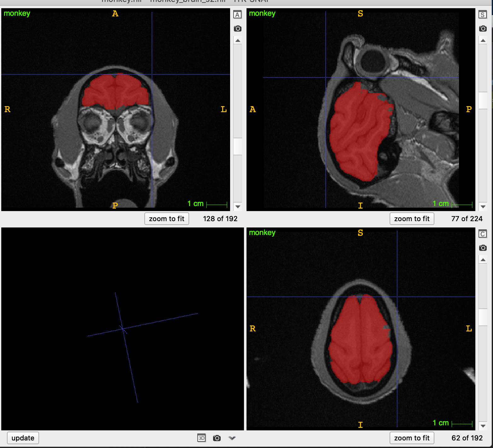
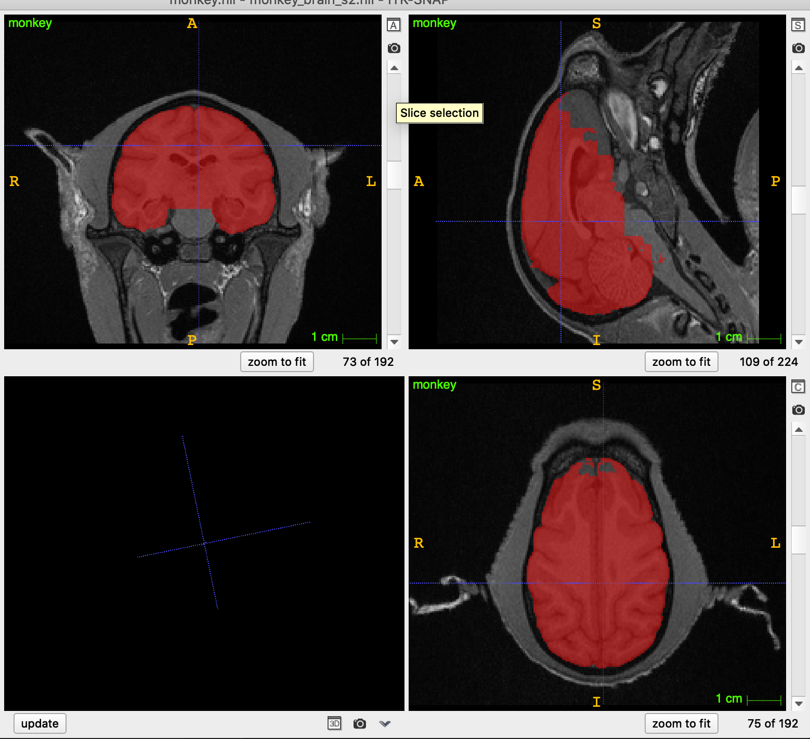
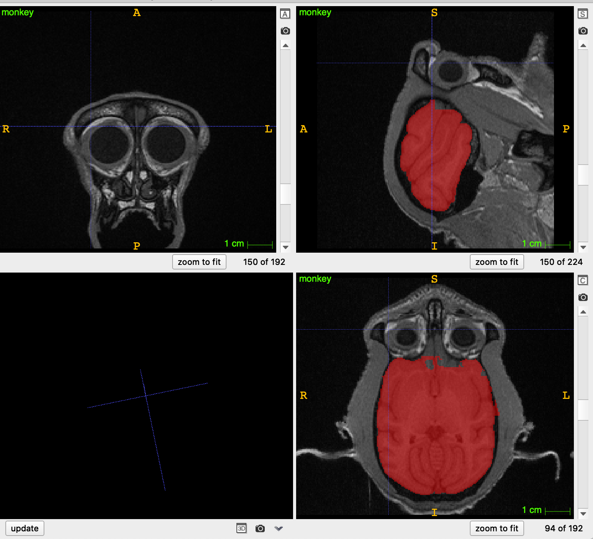

## 对脑组织进行提取
### 实现过程
```
尝试了BET、HD-BET、PARIETAL方法，直观上看PARIETAL效果最好。
由于没有相应的训练数据，直接使用了开源的预训练模型进行预测，该模型使用了silver-masks Calgary-Campinas-359 dataset训练

参考开源项目地址:
https://github.com/sergivalverde/PARIETAL
```

### 提取效果图片

图片1

图片2

图片3
