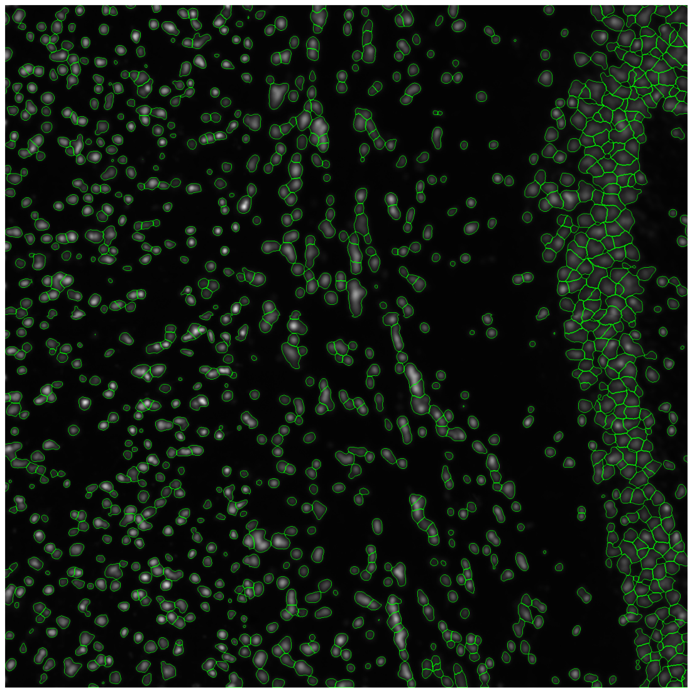
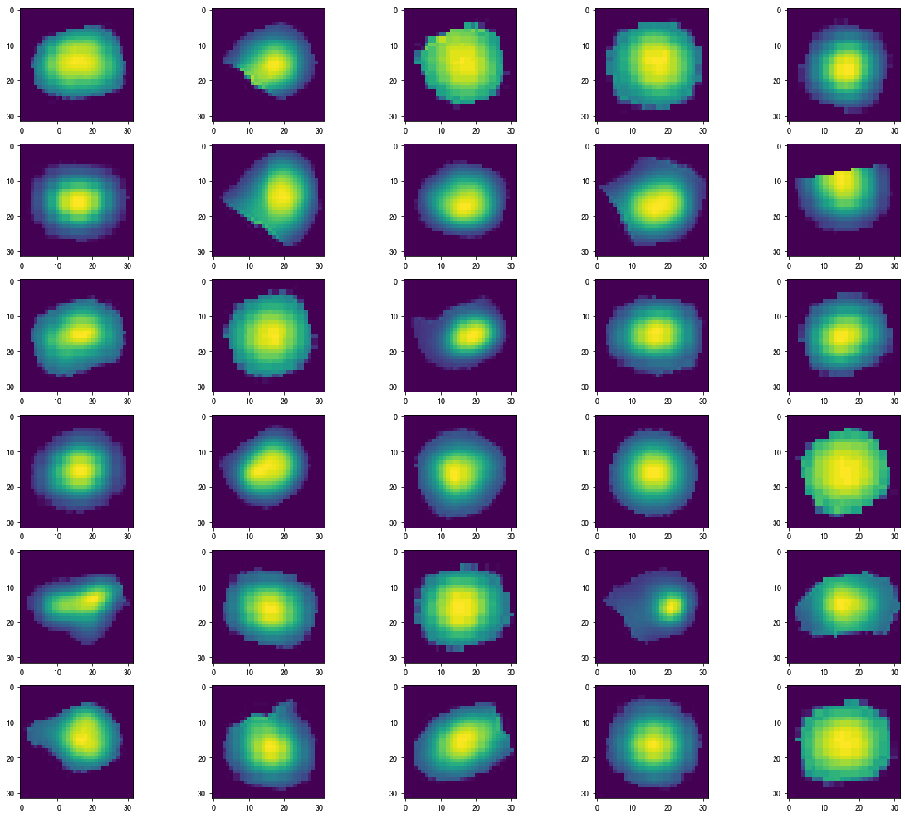
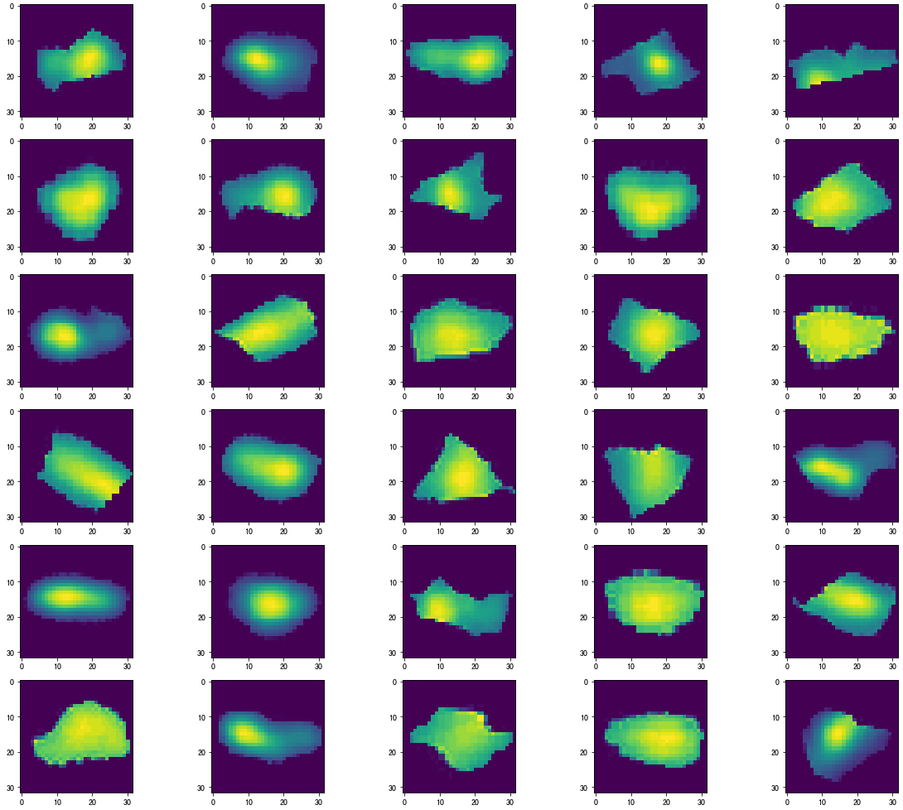
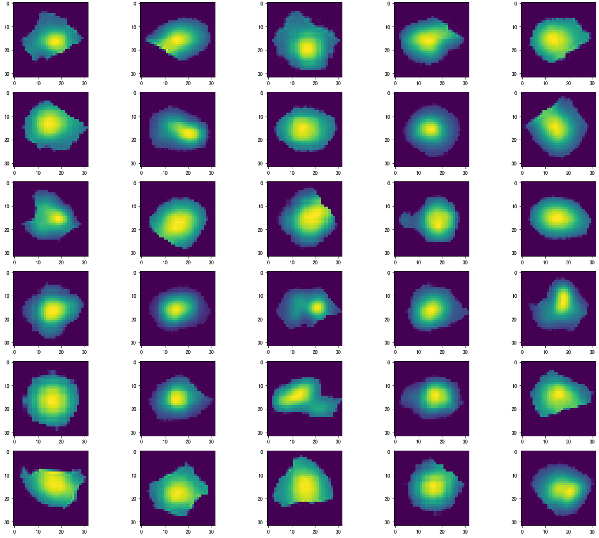

# 对细胞图片进行分割并对形态进行分类
### 分割过程
```
1、使用阈值分割方法，分割出细胞的大致轮廓
2、在阈值分割出的轮廓区域内，使用局部最大峰值方法找出局部区域内的峰值点
3、基于查找出的峰值点，使用分水岭分割算法对步骤1中的轮廓进行再分割
4、保存好分割出的每个细胞图片
```
### 分类过程
```
1、把分割出的图片大小统一resize到32x32的大小，然后使用AutoEncoder进行图片的特征提取，提取后的特征维度为:4x4x3,实现降维，维度由1024->48。
2、每张图片，使用降维后的48个维度特征，应用k-means算法进行分类，类别数量参数设置为3
3、根据k-means分类出的结果，大致可以把细胞形态分为:饱满圆形细胞、偏长条形细胞、其他形态细胞
```

### 分割效果图片


### 分类效果图片

#### 分类1：

#### 分类2：


#### 分类3：

